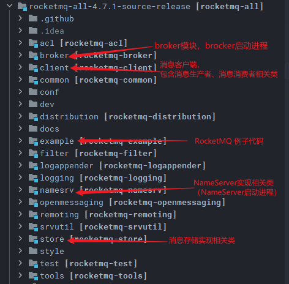
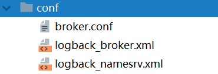
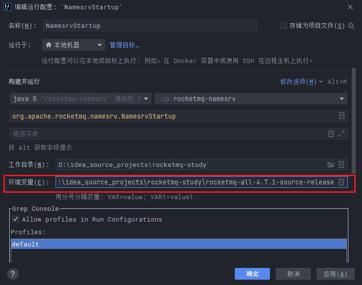
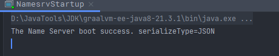
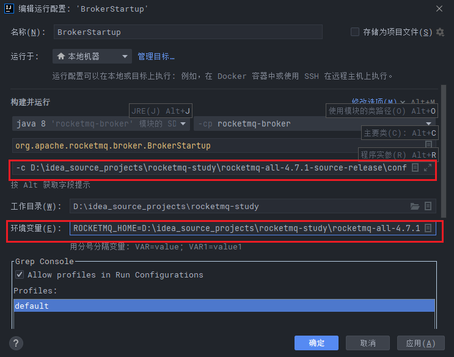
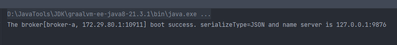

# rocketmq-study
RocketMQ源码学习,加注释

重要的注释设定标记`K1`，相对不那么重要的注解设定了一个标记`K2`,普通注释没有标记， 
可以使用Better Comments配置高亮


## 工程结构




## 编译

将源码导入IDEA后，需要先对源码进行编译。编译指令 

```shell
mvn clean install -Dmaven.test.skip=true
```

编译完成后就可以开始调试代码了。


## 调试

调试时需要按照以下步骤：

1. 先在项目目录下创建一个conf目录
2. 从`distribution`拷贝`broker.conf`和`logback_broker.xml`和`logback_namesrv.xml`




### 启动 NameServer

启动时会报错，提示需要配置一个`ROCKETMQ_HOME`环境变量。

这个环境变量可以在机器上配置，跟配置`JAVA_HOME`环境变量一样。也可以在IDEA的运行环境中配置。目录指向源码目录即可。

```properties
ROCKETMQ_HOME=D:\idea_source_projects\rocketmq-study\rocketmq-all-4.7.1-source-release
```




如下显示，NameServer启动成功




### 启动Broker

启动Broker时，同样需要`ROCETMQ_HOME`环境变量，并且还需要配置一个`-c` 参数，指向`broker.conf`配置文件。

```properties
ROCKETMQ_HOME=D:\idea_source_projects\rocketmq-study\rocketmq-all-4.7.1-source-release

-c D:\idea_source_projects\rocketmq-study\rocketmq-all-4.7.1-source-release\conf\broker.conf
```





启动成功




### 发送消息


在源码的`example`模块下，提供了非常详细的测试代码。

例如: 启动`example`模块下的`org.apache.rocketmq.example.quickstart.Producer`类即可发送消息。


在测试源码中，需要指定`NameServer`地址, 有两种指定方式:

- 一种是配置一个`NAMESRV_ADDR`的环境变量。
- 另一种是在源码中指定。我们可以在源码中加一行代码指定`NameServer`
